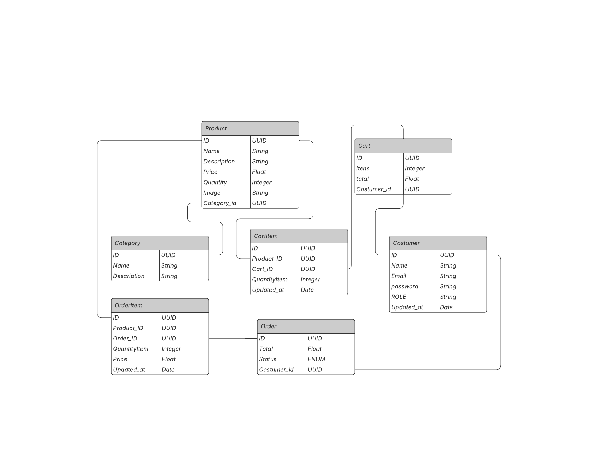

# E-commerce Project

Welcome to the E-commerce Project! This is a fully functional e-commerce platform built with modern technologies. Below, you'll find instructions on how to set up the project for development, as well as details about the database and API documentation.

## Getting Started



### Prerequisites
Before you begin, ensure you have the following installed:
- [Docker](https://www.docker.com/)
- [Docker Compose](https://docs.docker.com/compose/)

### Development Setup
To set up the development environment, follow these steps:

1. Run docker-compose to start projeto on develop mode:
   ```bash
   docker compose -f docker-compose.dev.yml up --build
2. Open localhost:port/api-docs to use swagger documentation.
